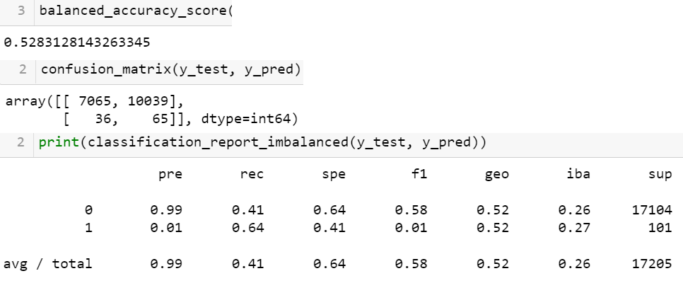

# Credit_Risk_Analysis

## Overview of the analysis

>This challenge dives into a comparison of 6 different machine learning scripts that are trained to predict whether a loain will be "high risk".  For any of them to work, some data munging was required on our csv file.  This was necessary in order to encode string information into a numeric type.  So our months changed to numbered (1-5 for jan-may), and all categorial info was divided into separate columns with 1's indicating that category in use and 0's when a different category was in the original column.  Then, in every case, we had to follow the pattern of machine learning coding:

1. Defining the features and the target
2. Splitting the data into training and testing sets 
3. Fitting the data into a prediction model 

    --typically by training a logicstic regression classifier

    --often resampling the data to adjust for drastic imbalance in the target
4. Evaluating the classifier's prediction(s)

    --balanced accuracy score

    --confusion matrix

    --classification report

## Results: 

> Below are the results of each of the 6 tests we ran:

* RandomOverSampler-
.
* SMOTE-
.
* ClusterCentroids-
.
* SMOTEENN-
.
* BalancedRandomForestClassifier
.
* EasyEnsembleClassifier
.

### Description of Stats

> There are a couple of key features to notice in comparison of results here.  

1. First, the general accuracy continues to get better as we go down the list of classifiers, with the notable exception of the ClusterCentroids method- the only one that is a stand-alone undersampling method here.  Otherwise, the accuracies range from approx 60% to 90&.  
2. In all cases, the precision of a predicting a high risk loan was very poor, less than 10% of those predicted as high risk really were (1% in every case but the EasyEnsemble).  This could be seen as desirable ("over-catching" conccerns) or undesirable (blocking funds from customers) depending on the point of view.
3. Sensitivity rates for high risk loans varied considerably among the different test, with the EasyEnsemble detection over 90% of the actual high risk cases.  After that, 60s and 70s was the norm.  It was understandable that the SMOTEENN test was next in line, with the advantages of oversampling, but adjusted.
4. Overall harmonic mean (F1) scoring shows that none of these models has a very high reliability at predicting high risk loans.  Scores out of 1 were as follows (.02,.02,.01,.02,.06,.16).  Ultimately this is because they all produced so many false positives many times more than the true positives they caught.  

## Summary
>Overall, it seems clear that the ensemble classifiers (both the BalancedRandomForest and the EasyEnsemble) that we were introducded to us in this challenge showed markedly improved performance over the simple over/under/combined sampling approaches.  It also continues to underscore how much more work it would take to get a very accurately trained machine.  We could do much more to focus the process and narrow the pertinent data.  Or better yet, given the right parameters, more advanced artificial intelligence can teach itself to improve on the results as long as we feed much more data.  Ultimately, if I had to pick one, I'd go wtih the EasyEnsembleClassifier.  I say from the side of the loaning institution- which here would have identified almost every high risk loan in the set (93 our of 101!).  Even the false positives were in the hundreds rather than the thousands, and perhaps a process of appeals could be set up that allows for a more "human" element to reign at the end of the day.  It would be a difficult challenge with 90% of rejections being actually safe applications, but the data set is vastly narrowed to that from the original 0.5% that was there to begin with- a 20 fold improvement!